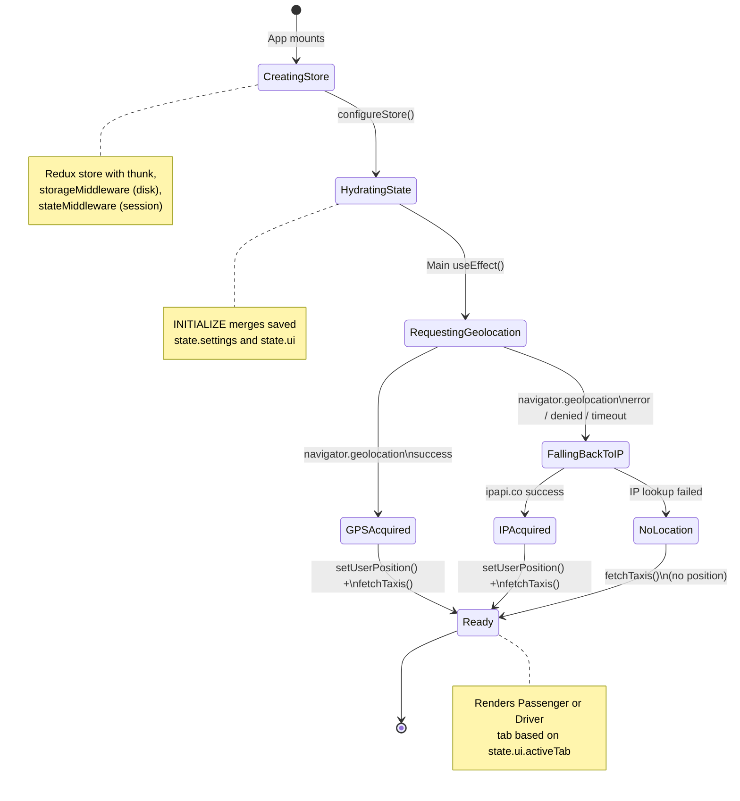
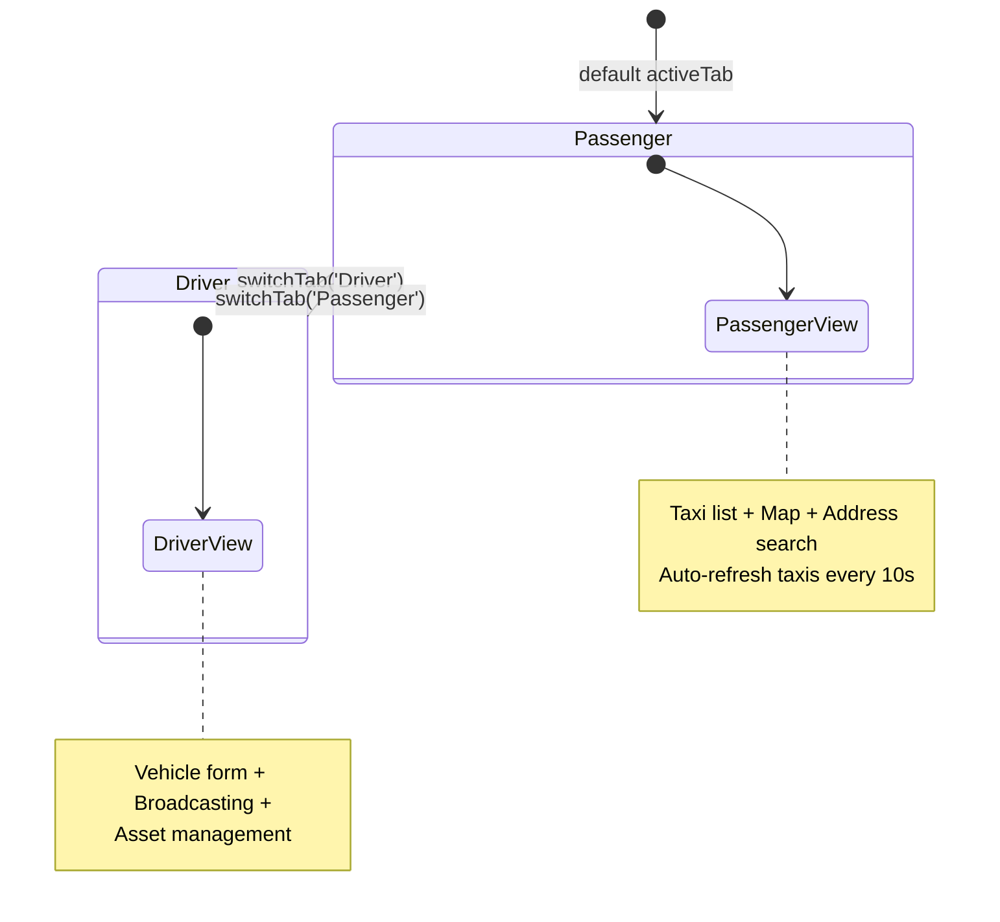
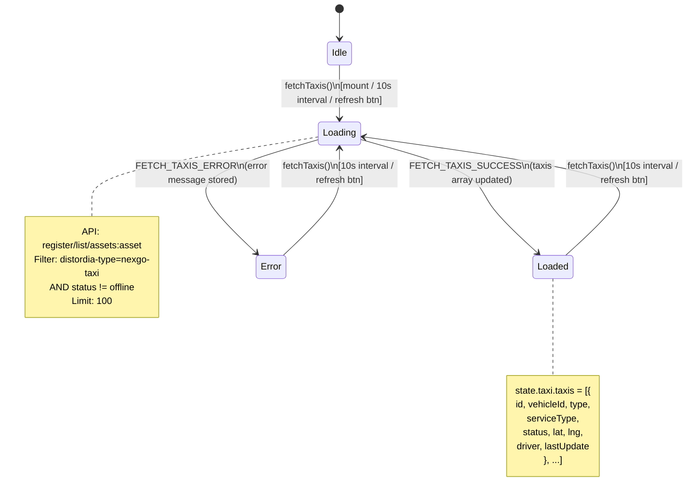
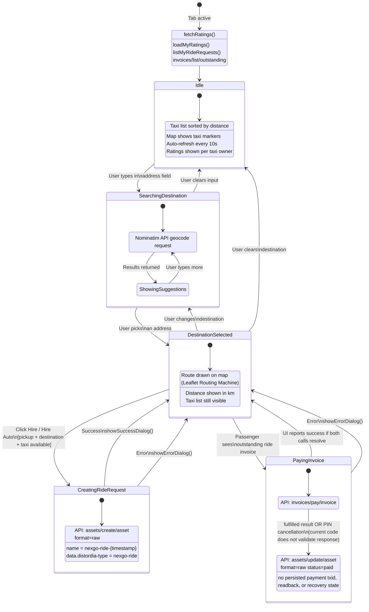
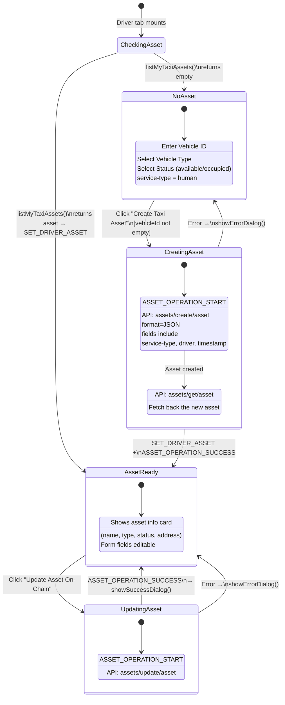
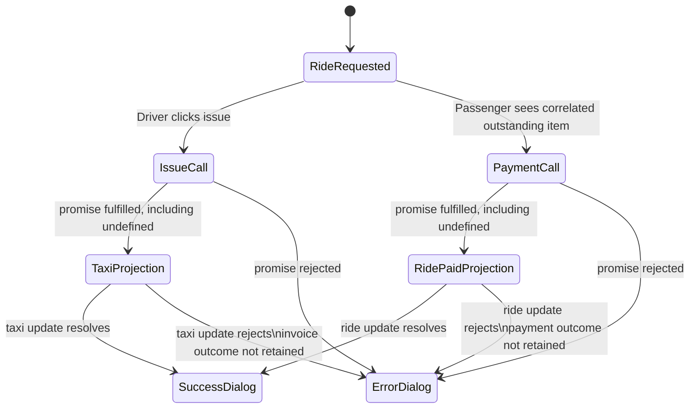
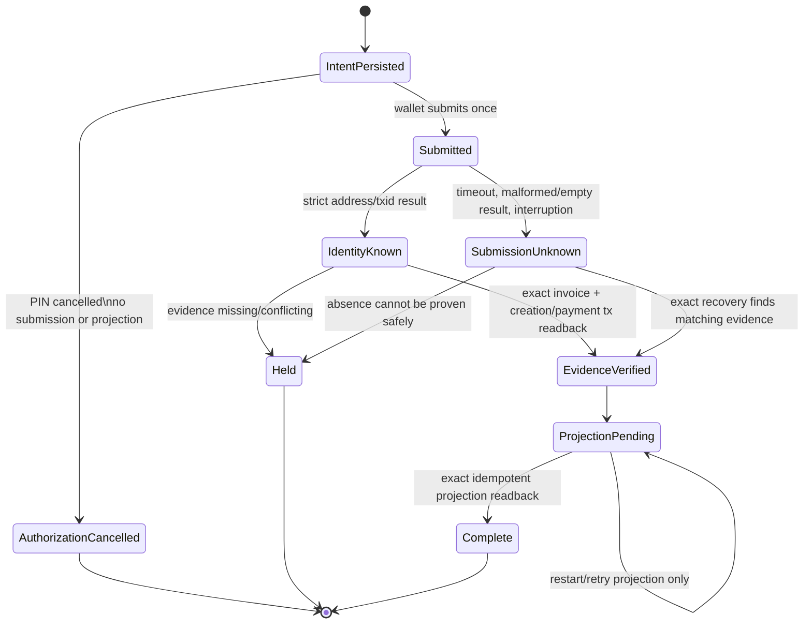
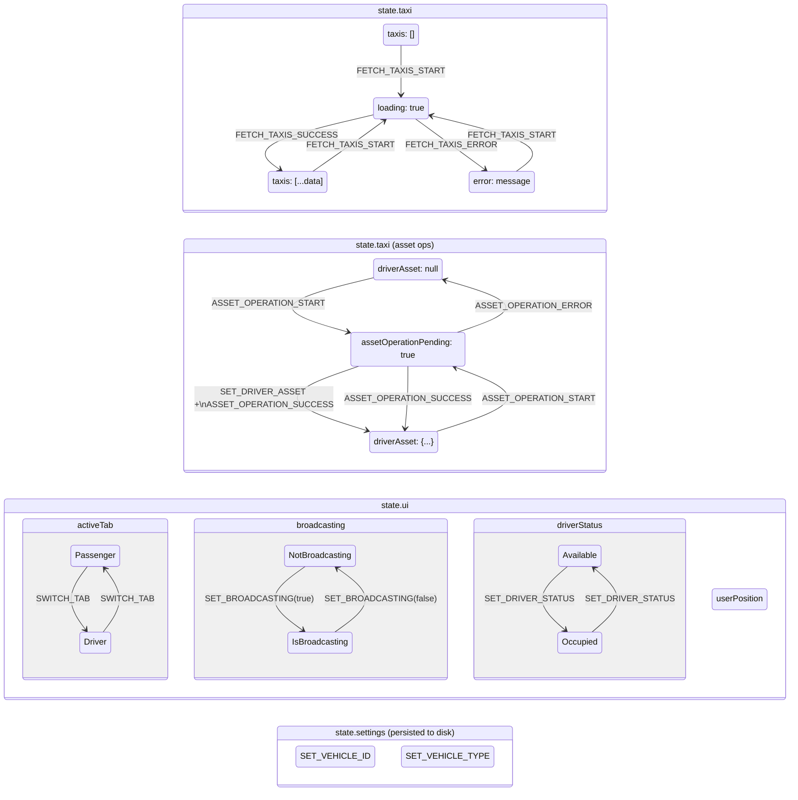

# NexGo State Machines

State machine diagrams for every major flow in the NexGo app.

> These diagrams describe the current UI orchestration, including known unsafe
> behavior; they are not verified payment atomicity or a normative protocol.
> The [architecture](ARCHITECTURE.md), [current evaluation](EVALUATION.md),
> [development plan](DEVELOPMENT_PLAN.md), and
> [2026-09-28 executed review](DEVELOPMENT_REVIEW_2026-09-28.md) define the
> strict invoice, authority, exact-money, recovery, privacy, and package gates.
> Current invoice controls are prohibited for real profiles or funds.

---

## 1. App Initialization



---

## 2. Tab Navigation



---

## 3. Taxi Fetching

Shared sub-flow used by the Passenger tab (initial mount, auto-refresh every 10s, and manual refresh).



---

## 4. Passenger Flow



---

## 5. Driver Asset Management

This flow is for human-operated taxis created inside the module. Autonomous taxis can skip the UI and create/update the same `nexgo-taxi` asset standard directly via the Nexus API.



---

## 6. Driver Broadcasting

```mermaid
stateDiagram-v2
    [*] --> Idle : Broadcasting = false

    state Idle {
        [*] --> Ready
        Ready : Form editable
        Ready : No GPS watch active
        Ready : No position updates sent
    }

    Idle --> StartingBroadcast : Click "Start Broadcasting"\n[vehicleId not empty, GPS available]

    state StartingBroadcast {
        [*] --> ValidateState
        ValidateState --> Blocked : No vehicleId / no position / no asset
        ValidateState --> PushInitialUpdate : Ready to publish
        PushInitialUpdate : API: assets/update/asset\n(status, lat, lng, timestamp)
        PushInitialUpdate --> ActivateBroadcast : Update succeeded
        ActivateBroadcast : setBroadcasting(true)
    }

    StartingBroadcast --> Idle : Error\nshowErrorDialog()
    StartingBroadcast --> Broadcasting : Broadcasting activated

    state Broadcasting {
        [*] --> Active
        Active : GPS watchPosition() running\n(high accuracy)
        Active : Redux userPosition updated locally
        Active : Form fields disabled

        state Active {
            [*] --> WaitingForManualPush
            WaitingForManualPush --> SendingUpdate : Click "Update Location On-Chain"
            SendingUpdate : API: assets/update/asset\n(lat, lng, status, vehicle-type, timestamp)
            SendingUpdate --> WaitingForManualPush : Success / Error dialog
        }
    }

    Broadcasting --> StatusChange : Toggle Available / Occupied
    StatusChange --> Broadcasting : setDriverStatus()\n(next on-chain push uses new status)

    Broadcasting --> StoppingBroadcast : Click "Stop Broadcasting"

    state StoppingBroadcast {
        [*] --> Deactivating
        Deactivating : setBroadcasting(false)
        Deactivating : Clear GPS watch
        Deactivating --> SettingOffline : Update asset\nstatus = 'offline'
        SettingOffline : API: assets/update/asset
    }

    StoppingBroadcast --> Idle : Done\n(silent error handling)

    state Blocked {
        [*] --> WaitingForInput
    }
```

---

## 7. Settlement: observed unsafe flow and required executable contract

The current UI is not a settlement state machine. It correlates by description text, sends the stale invoice destination key `account`, discards nested invoice terms, retains no issue/payment identity, and performs projections after any fulfilled mutation promise—including `undefined` returned when the wallet PIN prompt is cancelled.



The replacement must implement the following durable protocol. This is the acceptance target, not current behavior:



Issuer verification binds the exact invoice address to its retained creation transaction and provider genesis. Current invoice owner is lifecycle evidence: outstanding is system-owned and paid is recipient-owned. Payment verification compares nested terms and actual DEBIT/CLAIM evidence in bounded exact base units. Description `ride=...` is discovery-only. Neither an empty outstanding list nor a projection status proves issue/payment absence or success.

---

## 8. Full System Overview

```mermaid
stateDiagram-v2
    [*] --> AppInit

    state AppInit {
        [*] --> CreateStore
        CreateStore --> WalletListener
        WalletListener --> Geolocation
        Geolocation --> AppReady
    }

    AppInit --> TabNavigation

    state TabNavigation {
        state PassengerTab {
            TaxiFetching --> PassengerUI
            state PassengerUI {
                TaxiList
                MapView
                DestinationSearch
                RouteDisplay
                Ratings
                RideRequestCreation
            }
        }

        state DriverTab {
            AssetManagement --> BroadcastingSystem
            state AssetManagement {
                VehicleForm
                CreateAsset
                UpdateAsset
            }
            state BroadcastingSystem {
                GPSTracking
                PositionBroadcast
                StatusToggle
            }
        }

        PassengerTab --> DriverTab : switchTab
        DriverTab --> PassengerTab : switchTab
    }

    state Blockchain {
        RegisterListAssets : Taxi queries (public)
        AssetsCreate : Create taxi asset (auth)
        AssetsUpdate : Update position/status (auth)
        AssetsGet : Verify asset (public)
        AssetsList : List own assets (auth)
        AssetsCreateRaw : Create ride request (auth)
        InvoicesCreate : Prototype call (unsafe contract; blocked)
        InvoicesPay : Prototype call (unsafe recovery; blocked)
    }

    state ExternalAPIs {
        Nominatim : Address geocoding
        BrowserGPS : Geolocation API
        LeafletRouting : Route calculation
    }

    TabNavigation --> Blockchain
    TabNavigation --> ExternalAPIs
```



---

## Redux State Transitions


